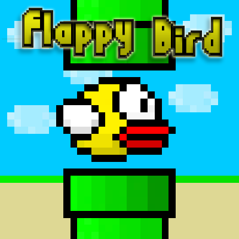

# Potter's games

<nav class="navbar">
  <ul>
      <li><a href="https://potter414.github.io/" class="active">Home</a></li>
      <li><a href="downloads.html" class="active">Downloads</a></li>
      <li><a class="active">Favorited Games</a></li>
      <li><a class="active">Popular Games</a></li>
      <li><a class="active">Instructions</a></li>
  </ul>
</nav>

This is a gamesite that has games I have created :D

<footer class="footer">
  
</footer>
